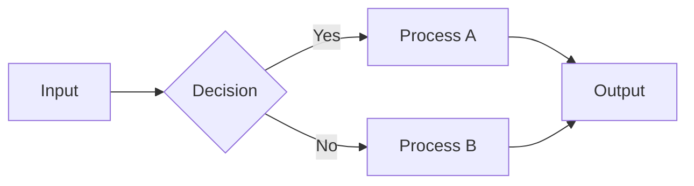
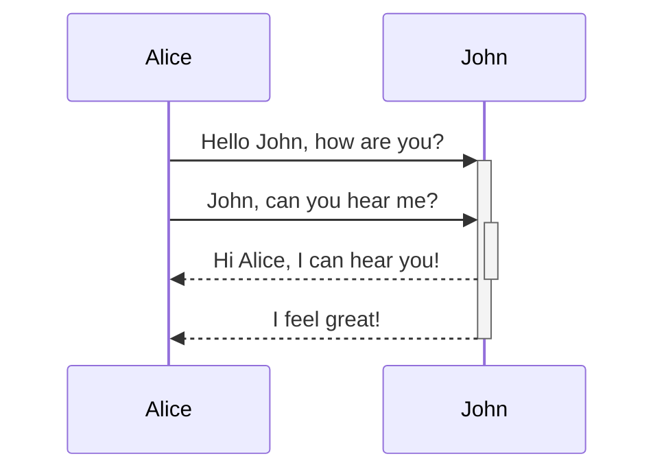
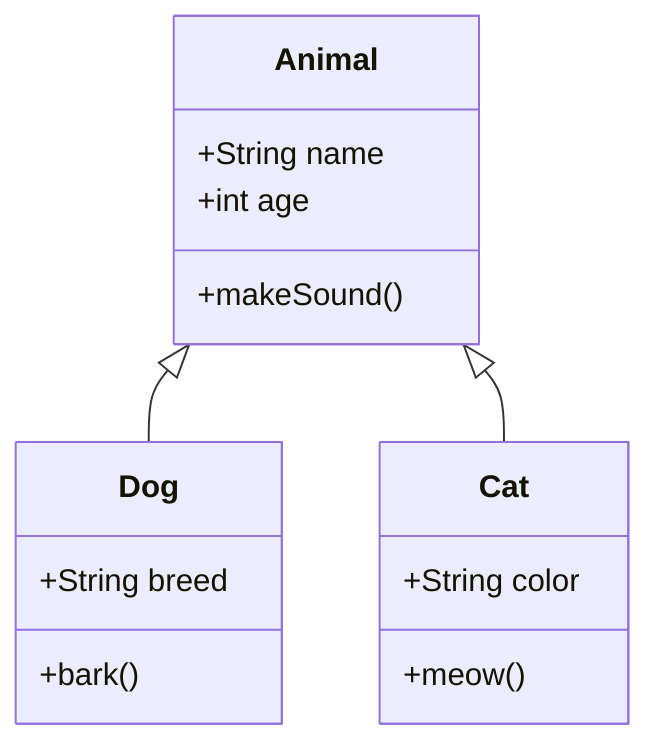
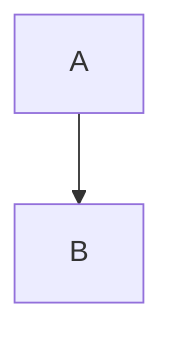

# Usage Guide: mdbook-excalidraw

## Quick Start

### 1. Build the Preprocessor

```bash
cd mdbook-excalidraw
cargo build --release
```

### 2. Install Binary

```bash
# Copy to system path
sudo cp target/release/mdbook-excalidraw /usr/local/bin/

# Or use cargo install
cargo install --path .
```

### 3. Setup Your mdBook Project

```bash
# Navigate to your mdbook project
cd /path/to/your/mdbook-project

# Install excalidraw preprocessor
mdbook-excalidraw install
```

Expected output:
```
✅ mdbook-excalidraw installed successfully!

Next steps:
  1. Run 'mdbook build' to build your book
  2. Mermaid code blocks will be converted to Excalidraw diagrams

Example usage in markdown:
  ```mermaid
  graph TD
      A[Start] --> B[Process]
      B --> C[End]
  ```
```

### 4. Add Mermaid Diagrams

Edit your markdown files (e.g., `src/chapter_1.md`):

```markdown
# Chapter 1: Architecture Overview

Here's our system architecture:

\`\`\`mermaid
graph TD
    User[User] --> LB[Load Balancer]
    LB --> API1[API Server 1]
    LB --> API2[API Server 2]
    API1 --> DB[(Database)]
    API2 --> DB
    API1 --> Cache[(Redis Cache)]
    API2 --> Cache
\`\`\`

## Sequence Flow

User authentication flow:

\`\`\`mermaid
sequenceDiagram
    participant User
    participant Frontend
    participant API
    participant Auth
    participant DB

    User->>Frontend: Login Request
    Frontend->>API: POST /auth/login
    API->>Auth: Validate Credentials
    Auth->>DB: Query User
    DB-->>Auth: User Data
    Auth-->>API: JWT Token
    API-->>Frontend: Token Response
    Frontend-->>User: Redirect to Dashboard
\`\`\`
```

### 5. Build and Serve

```bash
mdbook build
mdbook serve --open
```

Your browser will open showing interactive Excalidraw diagrams!

## Features Demonstration

### Feature 1: Interactive SVG Preview

Every Mermaid diagram is converted to an SVG preview that renders instantly.

### Feature 2: View Source

Click "View Mermaid Source" to see the original Mermaid code:



### Feature 3: Edit Button

Click "✏️ Edit in Excalidraw" to open editing modal (shows Mermaid source and link to online editor).

### Feature 4: Dark Theme Support

The diagrams automatically adapt to your mdbook theme (light/dark/ayu/navy/coal/rust).

## Supported Diagram Types

### Flowcharts


### Sequence Diagrams



### Class Diagrams



## Configuration Options

### Basic Configuration (Auto-generated)

```toml
[preprocessor.excalidraw]
command = "mdbook-excalidraw"

[output.html]
additional-js = ["theme/excalidraw.js"]
additional-css = ["theme/excalidraw.css"]
```

### Manual Configuration

If you want more control, you can manually configure:

1. **Disable auto-preprocessing** (use only for specific chapters):

```toml
[preprocessor.excalidraw]
command = "mdbook-excalidraw"
# Only run on chapters with "excalidraw: true" in frontmatter
```

2. **Custom CSS styling**:

Edit `theme/excalidraw.css` to customize:
- Container borders
- Button colors
- Loading states
- Error messages

## Testing

### Test the Preprocessor

```bash
cd mdbook-excalidraw

# Run unit tests
cargo test

# Run with verbose output
cargo test -- --nocapture

# Test specific function
cargo test test_add_excalidraw_simple
```

Expected test output:
```
running 5 tests
test tests::test_escape_html ... ok
test tests::test_add_excalidraw_simple ... ok
test tests::test_add_excalidraw_with_special_chars ... ok
test tests::test_multiple_mermaid_blocks ... ok
test tests::test_non_mermaid_blocks_unchanged ... ok

test result: ok. 5 passed; 0 failed; 0 ignored; 0 measured; 0 filtered out
```

### Test with Real Book

Create a test book:

```bash
# Create new mdbook
mdbook init test-excalidraw-book
cd test-excalidraw-book

# Install preprocessor
mdbook-excalidraw install

# Add sample diagrams
cat >> src/chapter_1.md << 'EOF'

# Excalidraw Test

## Simple Flow

\`\`\`mermaid
graph TD
    A[Start] --> B[Process]
    B --> C[End]
\`\`\`

## Complex Sequence

\`\`\`mermaid
sequenceDiagram
    participant Client
    participant Server
    participant Database

    Client->>Server: Request
    Server->>Database: Query
    Database-->>Server: Data
    Server-->>Client: Response
\`\`\`
EOF

# Build and serve
mdbook serve --open
```

## Troubleshooting

### Issue 1: "command not found: mdbook-excalidraw"

**Solution**: Ensure binary is in PATH:

```bash
# Check if binary exists
which mdbook-excalidraw

# If not found, copy to PATH
sudo cp target/release/mdbook-excalidraw /usr/local/bin/

# Verify installation
mdbook-excalidraw --version
```

### Issue 2: "book.toml not found"

**Solution**: Run install command from book root directory:

```bash
# Navigate to book root (where book.toml is)
cd /path/to/your/book

# Then install
mdbook-excalidraw install
```

### Issue 3: Diagrams Not Converting

**Checklist**:
1. ✅ Check `book.toml` has preprocessor config
2. ✅ Check `theme/excalidraw.js` exists
3. ✅ Check `theme/excalidraw.css` exists
4. ✅ Check browser console for JavaScript errors
5. ✅ Test with simple diagram first
6. ✅ Verify internet connection (CDN access needed)

**Debug steps**:

```bash
# Check if preprocessor is configured
grep -A 2 "\[preprocessor.excalidraw\]" book.toml

# Check if assets are installed
ls -la theme/excalidraw.*

# Rebuild with verbose logging
RUST_LOG=debug mdbook build

# Check browser console (F12)
# Look for "mdbook-excalidraw" or "mermaid-to-excalidraw" messages
```

### Issue 4: CDN Loading Failed

If CDN is blocked by corporate firewall:

1. Download libraries locally:

```bash
cd theme/

# Download mermaid-to-excalidraw
curl -o mermaid-to-excalidraw.js \
  https://unpkg.com/@excalidraw/mermaid-to-excalidraw@latest/dist/index.js

# Download excalidraw
curl -o excalidraw.js \
  https://unpkg.com/@excalidraw/excalidraw@latest/dist/excalidraw.production.min.js
```

2. Modify `theme/excalidraw.js`:

```javascript
// Change these lines:
const MERMAID_TO_EXCALIDRAW_CDN = '/mermaid-to-excalidraw.js';  // Local path
const EXCALIDRAW_CDN = '/excalidraw.js';  // Local path
```

3. Add to `book.toml`:

```toml
[output.html]
additional-js = [
    "theme/mermaid-to-excalidraw.js",
    "theme/excalidraw.js",
    "theme/excalidraw-init.js"
]
```

## Advanced Usage

### Custom Styling

Modify `theme/excalidraw.css` to customize appearance:

```css
/* Change container border color */
.excalidraw-wrapper {
    border: 2px solid #6965db;
}

/* Change edit button color */
.excalidraw-edit-button {
    background: #ff6b6b;
}

/* Adjust diagram padding */
.excalidraw-container {
    padding: 3rem;
}
```

### Integration with CI/CD

Add to your CI pipeline:

```yaml
# .github/workflows/deploy.yml
name: Deploy mdBook

on:
  push:
    branches: [ main ]

jobs:
  deploy:
    runs-on: ubuntu-latest
    steps:
      - uses: actions/checkout@v3

      - name: Install Rust
        uses: actions-rs/toolchain@v1
        with:
          toolchain: stable

      - name: Install mdbook-excalidraw
        run: |
          cargo install --path mdbook-excalidraw

      - name: Build book
        run: mdbook build

      - name: Deploy to GitHub Pages
        uses: peaceiris/actions-gh-pages@v3
        with:
          github_token: ${{ secrets.GITHUB_TOKEN }}
          publish_dir: ./book
```

## Performance Tips

1. **Large diagrams**: Break into smaller components
2. **Many diagrams**: Consider lazy loading
3. **Build time**: Preprocessing is fast (~ms per diagram)
4. **Client-side**: First load needs CDN fetch (cached after)

## Comparison: Before vs After

### Before (Plain Mermaid)

```

```

Output: Static SVG rendered by Mermaid.js

### After (mdbook-excalidraw)

```

```

Output:
- ✅ Interactive Excalidraw-style diagram
- ✅ "Edit in Excalidraw" button
- ✅ Collapsible source viewer
- ✅ Better visual aesthetics

## Next Steps

1. ✅ Install mdbook-excalidraw
2. ✅ Add Mermaid diagrams to your book
3. ✅ Build and test
4. 📚 Explore advanced features
5. 🎨 Customize styling
6. 🚀 Deploy to production

## Resources

- [mdBook Documentation](https://rust-lang.github.io/mdBook/)
- [Mermaid Documentation](https://mermaid.js.org/)
- [Excalidraw](https://excalidraw.com/)
- [@excalidraw/mermaid-to-excalidraw](https://www.npmjs.com/package/@excalidraw/mermaid-to-excalidraw)

---

**Happy Diagramming! 📊✨**
